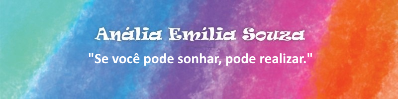

# Estilização com JavaScript

Como utilizar JavaScript para manipular e aplicar estilos dinamicamente em elementos HTML. Este método permite adicionar interatividade e personalização, além de modificar a aparência de elementos com base em ações do usuário ou condições dinâmicas.

## Introdução

JavaScript pode ser usado para estilizar elementos HTML de duas formas principais:

1. Manipulação direta do estilo (inline styles): Definindo estilos diretamente no atributo style de um elemento.
2. Adicionando/removendo classes: Usando CSS pré-definido e manipulando as classes de um elemento.

Ambas as abordagens são úteis dependendo da situação, mas o uso de classes é mais recomendado, pois mantém o código mais organizado.

## Aplicando Estilos com JavaScript

A propriedade style do JavaScript permite acessar e modificar propriedades CSS de um elemento. Por exemplo:

````javascript
const button = document.querySelector('button');

// Alterando estilos diretamente
button.style.backgroundColor = 'blue';
button.style.color = 'white';
button.style.padding = '10px';
button.style.borderRadius = '5px';
````

#### Cuidados:
* Inline styles sobrescrevem regras de CSS definidas em arquivos externos.
* Difícil de manter e reutilizar para projetos maiores.

## Adicionando e Removendo Classes

Usar a propriedade classList para adicionar, remover ou alternar classes é uma abordagem limpa e eficiente. Exemplos:

````js
const div = document.querySelector('.box');

// Adicionando uma classe
div.classList.add('active');

// Removendo uma classe
div.classList.remove('inactive');

// Alternando uma classe
div.classList.toggle('highlight'); // Adiciona se não existir, remove se já existir
````

#### Vantagens:

* Facilita a reutilização de estilos.
* Permite separar lógica (JavaScript) e apresentação (CSS).
* Mantém o código organizado.

## Eventos e Estilização Dinâmica

A estilização com JavaScript é frequentemente combinada com eventos para criar interatividade. Exemplo:

````js
const button = document.querySelector('button');

// Adicionando estilos ao clicar no botão
button.addEventListener('click', () => {
  button.style.backgroundColor = button.style.backgroundColor === 'blue' ? 'green' : 'blue';
});
````

Outro exemplo utilizando classes:

````js
const card = document.querySelector('.card');
const toggleButton = document.querySelector('#toggleButton');

toggleButton.addEventListener('click', () => {
  card.classList.toggle('flipped');
});

````

Neste caso, a classe flipped pode conter estilos no CSS, como:

````js
.card.flipped {
  transform: rotateY(180deg);
}
````

## Exemplo Prático

````HTML
<!DOCTYPE html>
<html lang="pt-br">
<head>
  <meta charset="UTF-8">
  <meta name="viewport" content="width=device-width, initial-scale=1.0">
  <title>Estilização com JavaScript</title>
  <style>
    .box {
      width: 100px;
      height: 100px;
      background-color: lightgray;
      transition: background-color 0.3s ease;
    }

    .box.active {
      background-color: blue;
    }
  </style>
</head>
<body>
  <div class="box"></div>
  <button id="toggleButton">Alternar Cor</button>

  <script src="script.js"></script>
</body>
</html>
````

#### JavaScript (script.js)

````js
const box = document.querySelector('.box');
const button = document.querySelector('#toggleButton');

button.addEventListener('click', () => {
  box.classList.toggle('active');
});
````

### Neste exemplo:

* O botão alterna a classe active no elemento .box, alterando sua cor de fundo.
* O uso de transições CSS (transition) melhora a experiência visual.

## Conclusão

A estilização com JavaScript é uma poderosa ferramenta para criar interfaces dinâmicas e interativas. Sempre que possível:

* Prefira manipular classes ao invés de inline styles.
* Combine estilos dinâmicos com eventos para melhorar a experiência do usuário.

Combinando CSS e JavaScript, você pode criar interfaces modernas, responsivas e com excelente desempenho.